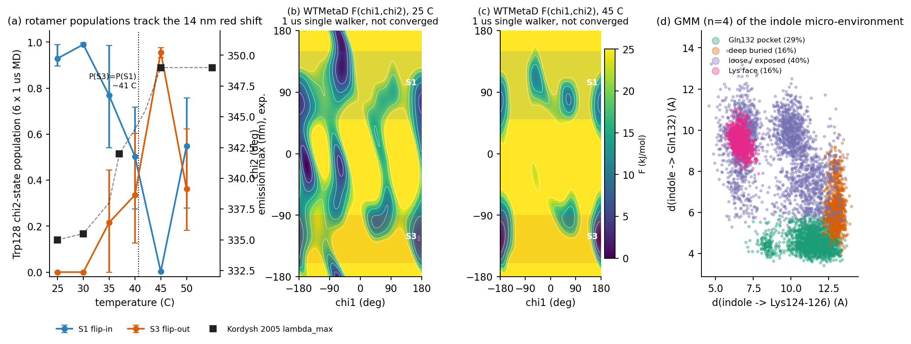

# emapii-trp

**Does the single tryptophan of EMAP II leave its pocket when the protein is warmed to body temperature?**
A reproducible re-analysis package (data + code + figures) behind the BSc thesis
*"Temperature Dependence of the Conformational Equilibrium of Tryptophan in the EMAP II Protein"*
(Oleksandr Shovkoplias, Taras Shevchenko National University of Kyiv, 2026; supervisor T. Nikolaienko,
consultant O. Kornelyuk).



*(a) Populations of the two Trp128 chi2 rotamers in six 1 us unbiased MD runs (AMBER03 + TIP3P), with the
experimental Trp emission maximum of Kordysh et al. 2005 on the right axis. (b, c) Well-tempered metadynamics
free-energy surfaces F(chi1, chi2) at 25 and 45 C -- single 1 us walkers, shown because they are NOT converged
(see below). (d) Gaussian-mixture clustering of the indole micro-environment: the flip-out rotamer sits in a
pocket lined by Gln132, the flip-in rotamer near the Lys124-126 face.*

Every number in this README is written by the scripts in `scripts/` from the files in `data/`
(`./run_all.sh`, ~15 s on a laptop CPU, no GPU, no MD engine, no trajectories needed).

---

## The question

Endothelial monocyte-activating polypeptide II (EMAP II, C-terminal module of AIMP1/p43, 166 aa, OB-fold)
contains **one tryptophan**. Its fluorescence maximum moves from **335 nm at 25 C to 349 nm at 45 C**
(+14 nm; Kordysh, Dubrovskyi, Kornelyuk 2005). The textbook reading of such a red shift is "the indole becomes
solvent-exposed". The thesis asked what the residue actually does in that temperature window, using the NMR
structure PDB 8ONG (Lozhko et al. 2026) as the starting point.

**Residue numbering.** Code and data use **PDB 8ONG numbering (Trp128, Gln132, Lys124-126)**; the mature-protein
numbering used in the fluorescence literature and in the publications is offset by -3 (**Trp125**, Gln129,
Lys121-123).

## What was simulated (not in this repository -- see [data provenance](#data-provenance))

```
PDB 8ONG (NMR model 1)
   |
   |-- GROMACS 2024/2025, TIP3P, 150 mM NaCl, 2 fs, V-rescale, PME
   |     |-- 6 x 1 us unbiased MD, AMBER03,   T = 25 30 35 40 45 50 C   (cloud servers, supervisor)
   |     |-- 3 x 200 ns unbiased MD, CHARMM36m, T = 25 37 42 C           (local RTX 4060 laptop; S1 only, not analysed here)
   |     '-- 6 x 1 us WTMetaD on (chi1, chi2) of Trp128, PLUMED 2.10     (cloud; sigma 0.35 rad, H 1.2 kJ/mol, gamma 10)
   |
   |-- per-frame tables (1 ns): chi2 with minimum-image correction, NoJump SASA, pocket distances  --> data/md_clean/
   |-- HILLS -> 200x200 FES grids                                                                    --> data/metad/
   |
   '-- THIS REPOSITORY: populations, Van't Hoff, SASA, GMM, FES, PBC demonstration --> results/, figures/

   (ORCA TD-DFT / excited-state-MD spectral branch of the thesis: not included here, see thesis.)
```

## Key results (all from `results/`)

**1. The rotamer switch is real and tracks the experimental window.** Trp128 chi2 (CA-CB-CG-CD1, GROMACS sign)
is bimodal: S1 "flip-in" at chi2 ~ +98 deg and S3 "flip-out" at ~ -117 deg (pooled medians). Populations
(chi2 windows S1 [50, 150], S3 [-160, -90]; 100-ns moving-block bootstrap 95% CI; `results/populations.csv`):

| T (C) | P(S1) | P(S3) | P(S2) | other |
|---|---|---|---|---|
| 25 | 0.93 [0.90, 0.99] | 0.00 | 0.00 | 0.07 |
| 30 | 0.99 [0.98, 1.00] | 0.00 | 0.00 | 0.01 |
| 35 | 0.77 [0.54, 0.99] | 0.22 [0.00, 0.44] | 0.00 | 0.01 |
| 40 | 0.50 [0.27, 0.72] | 0.34 [0.13, 0.60] | 0.05 | 0.11 |
| 45 | 0.00 | 0.96 [0.93, 0.98] | 0.04 | 0.01 |
| 50 | 0.55 [0.28, 0.76] | 0.36 [0.18, 0.62] | 0.06 | 0.03 |

P(S3) = P(S1) by linear interpolation at **~41 C**. The 50 C run is non-monotonic (S1 partly returns) and the
integrated autocorrelation time of the S3 indicator reaches ~200 ns at 35 C, i.e. ~5 independent samples per
microsecond -- these are single-replica numbers.

**2. Van't Hoff midpoint: a range, not a number** (`results/vant_hoff.csv`, `figures/vant_hoff.png`).
Fitting ln[P(S3)/P(S1)] vs 1/T gives **T_c = 35-40 C depending on the basin definition and on whether the
non-monotonic 50 C point is kept, with R^2 from 0.10 to 0.87**:

| basin definition | T used | T_c (C) | R^2 |
|---|---|---|---|
| windows S1 [50,150] / S3 [-160,-90] | 35, 40, 45, 50 | 37.0 | 0.12 |
| same, drop 50 C | 35, 40, 45 | 37.9 | 0.83 |
| sign cut S1 chi2 > 0 / S3 chi2 < -90 | 25, 35, 40, 45, 50 | 40.0 | 0.52 |
| same, drop 50 C | 25, 35, 40, 45 | 36.8 | 0.87 |
| windows S1 [60,130] / S3 [-160,-90] | 35, 40, 45, 50 | 35.4 | 0.10 |
| same, drop 50 C | 35, 40, 45 | 37.6 | 0.85 |

At 25 and 30 C the PBC-clean trajectories contain **zero** S3 frames, so those temperatures cannot enter the
fit. The computed crossover falls inside the experimental midpoint window (Kordysh 37-40 C, Lozhko HSQC 37-43 C,
Malyna ~42 C), but the thesis-era value T_c = 41.4 C is **not** reproduced: it rested on two low-temperature
points (P(S3) = 0.039 and 0.036) that are periodic-boundary artifacts (result 6).

**3. The hot rotamer is not solvent-exposed within the sampled microsecond -- but "buried flip-out" is
temperature-confounded** (`results/sasa_summary.json`, `figures/chi2_vs_sasa.png`).
At 45 C **0.0 %** of frames have indole SASA > 100 A^2 (max 79.8 A^2). Comparing the experimental endpoints,
S3 at 45 C (18.9 A^2, n = 957) is more buried than S1 at 25 C (25.6 A^2, n = 930), delta = -6.7 A^2. But pooled
over all six temperatures the sign flips (S1 22.3 vs S3 24.9 A^2, delta = +2.6 [+1.6, +3.6]), and at fixed
T = 35 / 40 C S3 is *more* exposed (+6.2 / +8.0 A^2). The robust statement is only: within these runs neither
rotamer reaches bulk-like exposure. **This is a timescale statement** -- the globule does not relax to its
high-temperature equilibrium form within 1 us (see Limitations) -- not evidence that exposure is excluded.

**4. The switch is an exchange between two internal pockets** (`results/gmm_*.csv`, `figures/gmm_pockets.png`).
A 4-component Gaussian mixture on (d_Gln132, d_Lys124-126, d_NE1-OE1, d_min, SASA) gives a "Gln132 pocket"
cluster (centroid d_Gln = 4.6 A, NE1-OE1 = 4.3 A) that is 79 % S3 and holds 73 % of all S3 frames, and a
"Lys face" cluster (d_Lys = 6.6 A) that is 96 % S1. Gln132-pocket occupancy rises 6 % -> 17 % -> 51 % -> 88 %
from 25 to 45 C. BIC keeps decreasing up to n = 8, so n = 4 is an interpretability choice, not a model-selection
result; the 30 C run forms its own very buried cluster (SASA 4.8 A^2), an anomaly of that single replica.

**5. Single-walker WTMetaD did not converge -- and that is the reported result** (`results/metad_dG.csv`,
`figures/metad_fes_6T.png`, `figures/metad_block_convergence.png`). dG(S3 - S1) from the six 1 us runs is
+1.8, -6.1, +6.4, -6.5, -8.0, -5.5 kJ/mol at 25...50 C: non-monotonic, with 13 kJ/mol jumps between neighbouring
temperatures and block-to-block spreads of 2-12 kJ/mol over the last 400 ns. Each walker settles into the S1- or
S3-dominated branch it fell into during its first ~200 ns. No transition temperature is derived from
metadynamics (a fit through these points gives R^2 = 0.25). The 25 C surface, the least unstable, puts the
trans-gated 1-D barrier S1 -> S3 through the S2 region at ~9.5 kJ/mol (~3.8 kT), consistent with the ns-scale
flips seen in the unbiased runs.

**6. Why NoJump / minimum-image matters** (`results/pbc_basin_changes.csv`, `figures/pbc_demo.png`).
Computing chi2 without the box splits the side chain across the periodic boundary in **400 of 6006 frames
(6.7 %)**, shifting them by ~130-150 deg and relabelling genuine S1 frames as S3. At 25 C the raw file reports
39 S3 frames; the clean one reports 0. The clean chi2 agrees with `gmx angle -type dihedral` to < 1 deg in
100 % of the compared frames (`results/convention_check.json`), confirming the GROMACS/IUPAC sign convention.

## Limitations (read before quoting)

* **Sampling.** One 1 us replica per temperature; chi2-state autocorrelation times of 100-200 ns at the
  crossover temperatures; the 50 C run is non-monotonic; CIs are within-trajectory and exclude between-replica
  variance. The WTMetaD runs are not converged (result 5). Multiple-walker WTMetaD / OPES is the pending fix.
* **No exposure events = timescale, not physics.** Within 6 x 1 us (AMBER03) and 3 x 200 ns (CHARMM36m) the
  protein does not relax to the form natural for it at 40-50 C (the CHARMM36m runs never flip at all in 200 ns;
  the 50 C run only begins to unfold; the experimental melting midpoint is ~45 C). A surface-exposed state
  remains possible and is simply not sampled here.
* **Force field.** All six long trajectories are **AMBER03 + TIP3P** (the APS abstract below says CHARMM36m --
  that was a labelling error corrected in the thesis). TIP3P-based thermostat temperatures carry a systematic
  +/- 10-20 K uncertainty relative to experiment; no temperature re-mapping is applied.
* **T_c is definition-dependent** (35-40 C, R^2 0.10-0.87); quote the range, not a point value.
* **GMM n = 4** is a choice; cluster names come from a fixed centroid rule (`scripts/04_gmm_pockets.py`).
* Nothing here is a spectroscopic calculation. The TD-DFT / excited-state-MD branch that connects the rotamer
  switch to the emission wavelength lives in the thesis, not in this repository.

## Reproduce

```bash
git clone <this repo> && cd emapii-trp
conda env create -f environment.yml && conda activate emapii-trp   # or: pip install -r requirements.txt
./run_all.sh           # tests + 7 scripts, ~15 s; regenerates results/*.csv|json and figures/*.png
```

Each script is a Typer CLI and runs from the repository root (`python scripts/02_vant_hoff.py --help`);
parameters (basin windows, bootstrap block length, GMM settings) live in `config.yaml`.
The analysis was developed and run on a laptop (16-core CPU, 14 GB RAM, RTX 4060 Laptop 8 GB -- the GPU is not
used by anything in this repository) with Python 3.12, numpy 2.4, scipy 1.16, pandas 2.3, matplotlib 3.9,
scikit-learn 1.8.

Re-extracting `data/md_clean/clean_perframe.npz` from the trajectories needs the 6 x 1 us `.xtc` files
(not shipped, see `scripts/fetch_trajectories.md`) and MDAnalysis: `python scripts/prepare_data.py --help`.

## Data provenance

`data/` is 3.4 MB; every file is listed with its origin in `data/MANIFEST.json` and described in
`data/README.md`. Summary:

| path | what | origin |
|---|---|---|
| `data/structure/8ONG_model1.pdb` | starting structure, model 1 of 19 | wwPDB 8ONG (Lozhko et al. 2026) |
| `data/md_clean/clean_perframe.npz` | 6006 frames x {chi2, d_Gln, d_Lys, d_NE1-OE1, d_min, SASA, KKK, T} | 6 x 1 us AMBER03 MD, box-aware MDAnalysis dihedrals + NoJump SASA |
| `data/md_clean/sasa_indole_{T}.xvg` | indole SASA at 1 ns (freesasa, NoJump) | same trajectories |
| `data/md_clean/chi2_gmx_100ps_{T}.xvg` | chi2 from `gmx angle`, 100 ps (T = 30-50 C) | same trajectories, downsampled x10 |
| `data/md_raw_pbc_broken/*` | chi1/chi2 WITHOUT min-image -- demonstration only | same trajectories |
| `data/metad/plumed_{T}.dat`, `plumed_opes_25.dat` | PLUMED inputs actually used (OPES: prepared, not run) | thesis working tree |
| `data/metad/fes_grid_{T}.npz` | 200x200 F(chi1, chi2) grids | reduced from 6 x 162 MB HILLS (1e6 hills each) |
| `data/metad/fes_basins_*.json` | thesis-era basin dG summaries (cross-check) | `ang/scripts/plot_metad_fes_6T.py` |
| `data/gmm_legacy/*` | thesis-era GMM labels and cross-tabs (different features) | `ang/scripts/cluster_pocket_n4.py` |
| `data/experiment/kordysh2005_lambda_max.csv` | digitised lambda_max(T), +/- 1 nm | Kordysh et al. 2005, figures |

## Presentations of this work

* **Oral**, APS Satellite Symposium, Bogolyubov Institute for Theoretical Physics, Kyiv, 17-19 March 2026:
  *"Conformational mobility of Trp125 in the EMAP II protein: molecular dynamics study"*
  (O. Shovkoplias, O. Kornelyuk, T. Nikolaienko).
* **Poster**, NANO-2026, Chernivtsi, 26-28 August 2026:
  *"Temperature-driven conformational switching of tryptophan in EMAP II protein: a molecular-dynamics study"*
  (O. S. Shovkoplias, T. Y. Nikolaenko, O. I. Korneliuk).

## References

* Kordysh M. O., Dubrovskyi O. L., Kornelyuk O. I. Local conformational transition of the Trp125 fluorophore in
  the cytokine EMAP II induced by physiological temperature. *Fizyka Zhyvoho* 13(1), 79-85 (2005). [in Ukrainian]
* Lozhko D., Kolomiiets L., Zhukova L., Taube M., et al. Solution 3D structure and conformational flexibility of
  EMAP II revealed by NMR spectroscopy and molecular dynamics simulations. *J. Struct. Biol.* 218, 108280 (2026).
  doi:10.1016/j.jsb.2025.108280. PDB 8ONG.
* Barducci A., Bussi G., Parrinello M. Well-tempered metadynamics. *Phys. Rev. Lett.* 100, 020603 (2008).
* Bussi G., Laio A. Using metadynamics to explore complex free-energy landscapes. *Nat. Rev. Phys.* 2, 200-212 (2020).
* Tribello G. A., Bonomi M., Branduardi D., Camilloni C., Bussi G. PLUMED 2. *Comput. Phys. Commun.* 185, 604-613 (2014).
* Abraham M. J. et al. GROMACS: high performance molecular simulations. *SoftwareX* 1-2, 19-25 (2015).
* Michaud-Agrawal N., Denning E. J., Woolf T. B., Beckstein O. MDAnalysis. *J. Comput. Chem.* 32, 2319-2327 (2011).
* Duan Y. et al. AMBER03 point-charge force field. *J. Comput. Chem.* 24, 1999-2012 (2003).
* Huang J. et al. CHARMM36m. *Nat. Methods* 14, 71-73 (2017).

## Citation

```
Shovkoplias O. (2026). emapii-trp: re-analysis package for the temperature-driven Trp125 rotamer switch in
EMAP II. BSc thesis, Taras Shevchenko National University of Kyiv. https://github.com/<user>/emapii-trp
```

License: MIT (see `LICENSE`).
